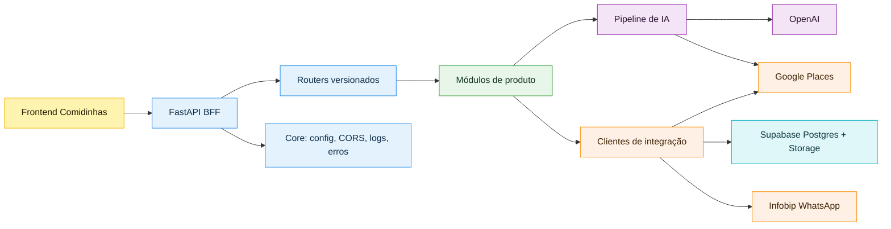
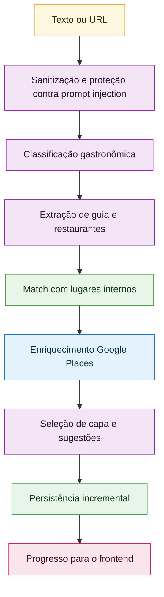

<div align="center">

# Comidinhas BFF

Backend for Frontend do Comidinhas: a camada inteligente que conecta produto,
dados, mapas, WhatsApp e IA para transformar escolhas gastronômicas em uma
experiência simples para pessoas, casais e grupos.


</div>

## Sumário

- [Visão do produto](#visão-do-produto)
- [Arquitetura](#arquitetura)
- [Stack atual](#stack-atual)
- [Pipeline de IA](#pipeline-de-ia)
- [Tecnologias futuras de IA](#tecnologias-futuras-de-ia)
- [Estrutura do projeto](#estrutura-do-projeto)
- [Configuração local](#configuração-local)
- [Supabase](#supabase)
- [Deploy](#deploy)
- [Qualidade](#qualidade)

## Visão do produto

O Comidinhas BFF é o cérebro de integração do app Comidinhas. Ele centraliza a
regra de negócio que o frontend não deve carregar, conversa com serviços
externos, normaliza dados de restaurantes e prepara respostas pensadas para uma
interface rápida, afetiva e orientada a decisão.

O projeto hoje cobre:

- perfis e contextos de uso para pessoa, casal e grupo;
- restaurantes salvos, favoritos, listas de "quero ir" e histórico do grupo;
- guias gastronômicos manuais e guias criados por IA;
- recomendações e decisões assistidas por IA;
- enriquecimento de lugares com dados do Google Places;
- comunicação via WhatsApp usando Infobip;
- persistência e arquivos no Supabase;
- observabilidade básica com logs estruturados, middleware HTTP e rastreio de jobs.

Este README descreve a arquitetura e as tecnologias do projeto. Ele evita expor
contratos detalhados de métodos ou rotas; para isso, use a documentação
interativa gerada pela aplicação durante o desenvolvimento.

## Arquitetura

O projeto segue uma arquitetura modular de BFF: a API fica fina, os casos de uso
concentram o comportamento de produto, e integrações externas ficam isoladas em
clientes próprios. Isso facilita trocar provedores, testar fluxos e evoluir a IA
sem espalhar dependências pelo código.



### Camadas

| Camada | Responsabilidade | Como aparece no projeto |
| --- | --- | --- |
| Entrada HTTP | Recebe chamadas do frontend, aplica versionamento e delega trabalho | `app/api` |
| Core | Configuração, ciclo de vida da app, CORS, erros e logging | `app/core` |
| Módulos | Casos de uso, schemas e regras de produto por domínio | `app/modules` |
| Integrações | Clientes para provedores externos e persistência | `app/integrations` |
| Dados | SQL, migrações, storage e evolução do schema | `supabase` |
| Testes | Cobertura de API, integrações, IA e regras principais | `tests` |

### Princípios de design

- **BFF primeiro:** o frontend recebe respostas já modeladas para a experiência
  do app, não payloads crus de provedores externos.
- **Domínio modular:** perfis, grupos, lugares, guias, decisões e IA evoluem em
  módulos separados.
- **Integrações isoladas:** OpenAI, Google Places, Supabase e Infobip ficam atrás
  de clientes internos.
- **IA resiliente:** jobs longos rodam fora do ciclo imediato da requisição, com
  progresso, reprocessamento, cancelamento e falhas parciais.
- **Privacidade por desenho:** recomendações usam contexto agregado sempre que
  possível, evitando expor dados individuais sensíveis.
- **Operação simples:** FastAPI, Uvicorn e Railway mantêm o deploy direto, com
  configuração por variáveis de ambiente.

## Stack atual

| Tecnologia | Papel no Comidinhas | Onde entra |
| --- | --- | --- |
| Python 3.11 | Linguagem principal do backend | aplicação, módulos e testes |
| FastAPI | Framework HTTP assíncrono | API BFF e documentação interativa |
| Uvicorn | Servidor ASGI | execução local e produção |
| Pydantic Settings | Configuração tipada por ambiente | `.env`, defaults e validação |
| HTTPX | Cliente HTTP assíncrono | chamadas para OpenAI, Google, Supabase e Infobip |
| Supabase Postgres | Banco operacional | perfis, grupos, lugares, guias e jobs de IA |
| Supabase Storage | Armazenamento de imagens | fotos de perfil, grupos e lugares |
| OpenAI API | IA generativa e extração estruturada | chat, recomendações e criação de guias |
| Google Places API | Dados ricos de restaurantes | busca, detalhes, fotos e geolocalização |
| Infobip WhatsApp | Mensageria transacional | convites, templates e comunicações externas |
| Pytest | Testes automatizados | API, integrações, regras e pipeline de IA |
| Railway | Hospedagem e runtime | deploy com health check |

## Pipeline de IA

A feature de guias com IA transforma textos ou links gastronômicos em guias
estruturados dentro do Comidinhas. A arquitetura foi pensada para aguentar textos
longos, provedores instáveis e respostas parciais sem perder o trabalho do
usuário.



### O que a IA já faz

- classifica se o conteúdo serve para virar guia gastronômico;
- extrai restaurantes de rankings, matérias, listas e textos grandes;
- divide textos longos em chunks com overlap para reduzir perda de contexto;
- preserva ordem de ranking quando ela existe no material original;
- cruza itens importados com restaurantes já salvos pelo grupo;
- usa Google Places para enriquecer endereço, fotos, rating e metadados;
- cria guias de forma incremental, permitindo que a experiência apareça antes
  do fim de todo o enriquecimento;
- calcula sugestões de uso do guia para o contexto do grupo;
- registra custo aproximado, chamadas externas, alertas e qualidade geral;
- suporta cancelamento, reexecução, watchdog e cache em processo.

### Fluxos de produto suportados pela IA

| Fluxo | Objetivo |
| --- | --- |
| Criar guia com IA | Converter texto ou link em guia gastronômico estruturado |
| Recomendar restaurantes | Interpretar desejo livre do usuário e retornar opções relevantes |
| Decidir restaurante | Escolher uma opção a partir de favoritos, listas ou guias |
| Reparar buscas | Melhorar consultas ao Maps quando o nome importado é ambíguo |
| Sugerir para o grupo | Priorizar opções com base no contexto coletivo disponível |

## Tecnologias futuras de IA

<details open>
<summary><strong>Aba de evolução IA-first</strong></summary>

| Tecnologia | Para que vamos usar | Ganho esperado |
| --- | --- | --- |
| OpenAI Embeddings | Busca semântica de restaurantes, guias e preferências | Encontrar lugares por intenção, não só por palavra exata |
| pgvector no Supabase | Armazenar vetores junto dos dados do produto | RAG e ranking sem sair da stack atual |
| RAG contextual | Responder usando histórico, guias, favoritos e preferências do grupo | Recomendações mais precisas e explicáveis |
| Tool calling com agentes | Orquestrar Supabase, Maps e lógica de decisão em fluxos multi-etapa | Assistente mais autônomo para planejar saídas |
| Vision/OCR multimodal | Ler cardápios, prints, posts e fotos de listas gastronômicas | Importar conteúdo visual sem digitação |
| Re-ranking semântico | Reordenar candidatos por gosto do grupo, momento e intenção | Decisões menos genéricas e mais pessoais |
| LLM evals | Testar prompts, extrações e recomendações como regressão de produto | Menos surpresa ao trocar prompts ou modelos |
| Observabilidade de LLM | Medir latência, custo, qualidade, tokens e falhas por etapa | Controle de operação e custo de IA |
| Prompt registry | Versionar prompts, modelos e parâmetros por feature | Rollback rápido e experimentos seguros |
| Redis + workers | Tirar jobs pesados do processo web | IA mais escalável, durável e previsível |
| Guardrails de IA | Filtrar prompt injection, PII e respostas fora de escopo | Mais segurança para dados e experiência |
| Personalização aprendida | Inferir preferências com base em interações do usuário | Recomendações que melhoram com o uso |

</details>

## Estrutura do projeto

```text
comidinhas-bff/
  app/
    api/
      routes/
      v1/
    core/
    integrations/
      google_places/
      infobip/
      openai/
      supabase/
    modules/
      chat/
      decisoes/
      google_places/
      groups/
      grupos/
      guias/
      guias_ai/
      home/
      infobip/
      lugares/
      perfis/
      places/
      profiles/
  supabase/
    migrations/
  tests/
  main.py
  pyproject.toml
  requirements.txt
  railway.toml
```

### Domínios principais

| Domínio | Responsabilidade |
| --- | --- |
| Perfis | Identidade de uso, preferências e contexto individual |
| Grupos | Espaços compartilhados, membros, convites e permissões |
| Lugares | Restaurantes salvos, status, fotos, favoritos e metadados |
| Guias | Coleções manuais ou geradas por IA |
| Guias IA | Pipeline de importação, extração, enriquecimento e sugestões |
| Decisões | Recomendações e escolha assistida de restaurantes |
| Home | Agregados para a tela inicial do contexto ativo |
| Integrações | Provedores externos e persistência |

## Configuração local

### Pré-requisitos

- Python 3.11+
- Conta e projeto Supabase
- Chave OpenAI para recursos de IA
- Chave Google Maps/Places para enriquecimento de restaurantes
- Credenciais Infobip se o WhatsApp estiver habilitado

### Instalação

```powershell
python -m venv .venv
.venv\Scripts\Activate.ps1
pip install -e .[dev]
```

### Ambiente

```powershell
Copy-Item .env.example .env
```

Depois, preencha o `.env` conforme os provedores que deseja habilitar.

| Grupo | Variáveis principais |
| --- | --- |
| App | `APP_NAME`, `APP_ENV`, `APP_VERSION`, `WEB_APP_BASE_URL`, `WEB_GROUP_INVITE_PATH` |
| Logs | `LOG_LEVEL`, `LOG_HTTPX_LEVEL`, `LOG_UVICORN_ACCESS_LEVEL`, `LOG_REQUEST_BODY`, `LOG_INTEGRATION_PAYLOADS` |
| OpenAI | `OPENAI_API_KEY`, `OPENAI_CHAT_MODEL` |
| Google Places | `GOOGLE_MAPS_API_KEY`, `GOOGLE_PLACES_DEFAULT_LANGUAGE_CODE`, `GOOGLE_PLACES_DEFAULT_REGION_CODE`, `GOOGLE_PLACES_MAX_PHOTOS_PER_PLACE` |
| Guias IA | `GUIAS_AI_ENABLED`, `GUIAS_AI_CHAT_MODEL`, `GUIAS_AI_CLASSIFIER_MODEL`, `GUIAS_AI_EXTRACTOR_MODEL`, `GUIAS_AI_TEXT_MAX_CHARS`, `GUIAS_AI_MAX_ITEMS_PER_GUIDE`, `GUIAS_AI_JOB_MAX_SECONDS` |
| Supabase | `SUPABASE_URL`, `SUPABASE_KEY`, buckets de perfil, grupo e lugares |
| Infobip | `INFOBIP_BASE_URL`, `INFOBIP_API_KEY`, `INFOBIP_WHATSAPP_FROM`, template e idioma padrão |

### Execução

```powershell
python main.py
```

Aplicação local:

- app: `http://127.0.0.1:8000`
- documentação interativa: `http://127.0.0.1:8000/docs`
- health check: `http://127.0.0.1:8000/health`

## Supabase

O banco fica em `supabase/` e combina schema base com migrações incrementais.
O fluxo atual do app usa tabelas no-auth para simplificar a experiência de
produto enquanto a autenticação completa pode evoluir em paralelo.

Ordem sugerida para um ambiente novo:

1. Execute `supabase/schema.sql`.
2. Execute `supabase/group_join_requests_setup.sql` se precisar de convites e
   solicitações de entrada.
3. Execute `supabase/place_photos_setup.sql` se for usar fotos de lugares.
4. Execute as migrações em `supabase/migrations/`, mantendo a ordem do nome dos
   arquivos.

Migrações importantes de IA:

| Arquivo | Objetivo |
| --- | --- |
| `20260502120000_ai_guides.sql` | Estrutura de guias por IA, itens e jobs |
| `20260502130000_ai_guides_v2.sql` | Cancelamento, retry e suporte ao watchdog |

Arquivos legados de autenticação ainda existem para referência e evolução, mas
o fluxo principal do produto hoje está no modelo no-auth.

## Deploy

O projeto já vem pronto para Railway:

- `railway.toml` define builder, comando de start, health check e política de
  restart;
- `Procfile` mantém compatibilidade com runtimes que leem processo `web`;
- o servidor sobe com Uvicorn escutando a porta entregue pelo ambiente.

Comando de produção:

```bash
python -m uvicorn app.main:app --host 0.0.0.0 --port $PORT
```

## Qualidade

### Testes

```powershell
pytest
```

A suíte cobre:

- criação da aplicação e rotas principais;
- fluxos no-auth de perfis, grupos, lugares e guias;
- integrações com clientes externos usando mocks;
- recomendações e decisões por IA;
- pipeline de guias com IA, incluindo job runner, URL fetcher e enriquecimento.

### Convenções importantes

- Configuração sempre via `Settings` e variáveis de ambiente.
- Integrações externas devem ficar em `app/integrations`.
- Regras de produto devem ficar nos módulos correspondentes em `app/modules`.
- Novas features de IA devem registrar progresso, custo, alertas e caminho de
  fallback quando possível.
- Documentação pública deve explicar arquitetura e intenção, não contratos
  internos sensíveis.

## Identidade técnica

O Comidinhas BFF não é só uma API de cadastro de restaurantes. Ele é uma camada
de inteligência de produto: entende contexto, transforma conteúdo solto em dados
úteis, conversa com mapas e IA, preserva a experiência do grupo e entrega ao
frontend uma base pronta para decisões melhores.

Em resumo: FastAPI dá velocidade, Supabase dá estrutura, Google Places dá mundo
real, OpenAI dá interpretação, e o BFF costura tudo em uma experiência simples.
